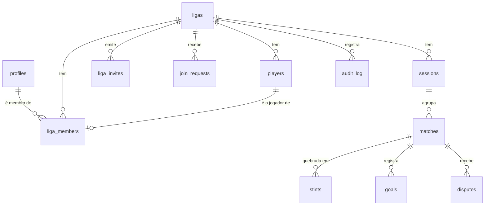

# Banco de dados — Raxa (v2)

> Modelo de dados do backend. O protótipo (`index.html`) roda em `localStorage`; este documento descreve
> para onde ele vai quando virar app de verdade, sem mudar nenhuma regra de produto.
> Produto em [DOCUMENTACAO.md](DOCUMENTACAO.md) · requisitos em [REQUISITOS-FUNCIONAIS.md](REQUISITOS-FUNCIONAIS.md)
> · decisões em [DECISOES.md](DECISOES.md).

**Alvo:** Postgres (Supabase) — Auth, Row Level Security e Realtime saem prontos.
Todo o motor (`splitStints`, `computeElo`, `updateRank`, `applyMatch`, `rebuildAll`) é função pura e sobe
sem reescrita, como Edge Function ou como job chamado pelo cliente.

---

## 1. Princípios que o esquema tem que sustentar

1. **O histórico é a fonte da verdade.** Rating e patente são *derivados* — `rebuildAll` recalcula tudo do
   zero a partir das partidas válidas. As colunas de rating em `players` são cache, nunca origem.
2. **Estatística não se guarda.** Duelos, parcerias, presenças e aproveitamento saem dos trechos na hora
   da consulta. Não existe contador para desencontrar do histórico.
3. **A partida é auto-suficiente.** Ela carrega o modo, o formato, as escalações, os pesos e o resultado.
   Mudar a configuração da liga hoje não pode alterar o passado.
4. **O rating numérico nunca sai para a interface.** Ele existe em coluna, e a API só devolve patente e
   divisão — e só quando a valência existe (`tem_linha` / `tem_gol`). Quem enxerga patente é decisão da
   liga (`cfg.rankVisibility`).
5. **Uma pessoa, um jogador por liga.** O vínculo conta↔jogador é 1:1 e mora em `liga_members`.

---

## 2. Visão geral



---

## 3. Contas e ligas

```sql
-- Identidade. auth.users é do Supabase; profiles é o que o app mostra.
create table profiles (
  id          uuid primary key references auth.users(id) on delete cascade,
  handle      citext unique not null,          -- @rodrigo — é por aqui que o admin acha alguém
  nome        text   not null,
  avatar_url  text,
  criado_em   timestamptz not null default now()
);

create table ligas (
  id            uuid primary key default gen_random_uuid(),
  nome          text not null,
  codigo        char(6) unique not null,       -- código curto para entrar: "RXA7Q2"
  entrada_livre boolean not null default false,-- código entra direto ou vira pedido?
  cfg           jsonb  not null default '{}',  -- alvo, estabilidade, nomes de patente, visibilidade…
  criada_por    uuid   not null references profiles(id),
  criada_em     timestamptz not null default now(),
  apagada_em    timestamptz                    -- soft delete: histórico não some sem querer
);
```

`cfg` é o mesmo objeto de configuração do protótipo (`defCfg()`), guardado inteiro. Regra de negócio
nova entra como chave nova, sem migração de esquema.

---

## 4. Membros e jogadores — o vínculo 1:1

```sql
create type papel_liga  as enum ('admin','editor','lancador','jogador');
create type status_membro as enum ('ativo','removido');

create table players (
  id             uuid primary key default gen_random_uuid(),
  liga_id        uuid not null references ligas(id) on delete cascade,
  nome           text not null,
  costuma_gol    boolean not null default false,
  -- cache do motor: reconstruível por rebuildAll(), nunca exibido cru
  base_linha     int  not null default 1500,
  rating_linha   int  not null default 1500,
  rank_linha     int  not null default 7,
  protect_linha  int  not null default 0,
  tem_linha      boolean not null default true,   -- patente de linha existe? (cadastro ou ja jogou)
  base_gol       int  not null default 1500,
  rating_gol     int  not null default 1500,
  rank_gol       int  not null default 7,
  protect_gol    int  not null default 0,
  tem_gol        boolean not null default false,  -- quem nunca pegou no gol NAO tem patente de goleiro
  removido       boolean not null default false,  -- sai das listas, fica no histórico
  criado_em      timestamptz not null default now()
);
create index on players (liga_id) where removido = false;

create table liga_members (
  liga_id       uuid not null references ligas(id) on delete cascade,
  user_id       uuid not null references profiles(id) on delete cascade,
  player_id     uuid not null references players(id) on delete restrict,
  papel         papel_liga    not null default 'lancador',
  status        status_membro not null default 'ativo',
  convidado_por uuid references profiles(id),
  entrou_em     timestamptz not null default now(),
  primary key (liga_id, user_id),
  -- É ISTO que garante "um membro é um jogador só":
  unique (liga_id, player_id)
);
create index on liga_members (user_id) where status = 'ativo';
```

**As regras que caem de graça deste desenho:**

| Regra | Como o banco garante |
|---|---|
| Um membro tem exatamente um jogador | `player_id NOT NULL` + `unique (liga_id, player_id)` |
| Um jogador pertence no máximo a um membro | a mesma `unique` |
| Perfil sem dono | um `players` sem linha em `liga_members` — nasce assim quando alguém cadastra "Bruninho" |
| Remover um membro não apaga histórico | `status='removido'`; a linha some de `liga_members` só se o admin desvincular, e aí o jogador volta a ser sem dono |
| Jogador não some do histórico | `players.removido = true`, `on delete restrict` no vínculo |
| A mesma pessoa em várias ligas | uma linha de `liga_members` por liga, cada uma apontando para o `players` daquela liga |

> **Patente é por liga, sempre.** Não existe rating global: `players` é por liga, e é lá que o rating mora.

---

## 5. Convite e entrada — os três caminhos

```sql
create type tipo_convite   as enum ('link','direto');
create type status_convite as enum ('pendente','aceito','recusado','expirado','revogado');

create table liga_invites (
  id          uuid primary key default gen_random_uuid(),
  liga_id     uuid not null references ligas(id) on delete cascade,
  tipo        tipo_convite not null,
  token       text unique,                    -- só para tipo 'link'
  para_user   uuid references profiles(id),   -- só para tipo 'direto'
  player_id   uuid references players(id),    -- perfil já reservado para essa pessoa (opcional)
  papel       papel_liga not null default 'lancador',
  usos_max    int not null default 1,         -- link da liga: pode ser N; convite direto: sempre 1
  usos        int not null default 0,
  expira_em   timestamptz not null default now() + interval '7 days',
  status      status_convite not null default 'pendente',
  criado_por  uuid not null references profiles(id),
  criado_em   timestamptz not null default now(),
  check (tipo = 'link' and token is not null and para_user is null
      or tipo = 'direto' and para_user is not null)
);
create index on liga_invites (liga_id, status);
create unique index on liga_invites (liga_id, para_user) where status = 'pendente';

create table join_requests (
  id          uuid primary key default gen_random_uuid(),
  liga_id     uuid not null references ligas(id) on delete cascade,
  user_id     uuid not null references profiles(id) on delete cascade,
  status      status_convite not null default 'pendente',
  decidido_por uuid references profiles(id),
  decidido_em  timestamptz,
  criado_em    timestamptz not null default now(),
  unique (liga_id, user_id)
);
```

### 5.1 Link de convite
O admin gera o link (`/entrar/<token>`), manda no grupo do WhatsApp. Quem abre e está logado vê o nome da
liga e a lista de **perfis sem dono**: escolhe o seu ou cria um novo. Ao confirmar, sai uma linha em
`liga_members` e o convite soma um uso. O link é **revogável** (`status='revogado'`) e vence em 7 dias por
padrão — link vazado não vira porta aberta para sempre.

### 5.2 Código da liga
Todo racha tem um código de 6 caracteres visível nos ajustes ("RXA7Q2"). Quem digita o código:
- se `entrada_livre = true`, entra na hora, igual ao link;
- se não, cria um `join_requests` **pendente** e o admin aprova ou recusa. É o padrão.

### 5.3 Busca dentro do app
O admin procura por `@handle` ou nome em `profiles` e convida direto: nasce um `liga_invites` do tipo
`direto`, e a pessoa vê o convite na tela dela. **Ninguém entra sem aceitar** — nem por busca, nem por
código, nem por link. Convidar já pode reservar o perfil (`player_id`), então quem aceita cai direto no
histórico certo: "você é o Bruninho, 42 partidas, Ouro 2".

### 5.4 O que o admin controla
Tudo o que envolve membro é do admin, e cada ação vira linha no `audit_log`:

| Ação | Efeito |
|---|---|
| Convidar / revogar convite | `liga_invites` |
| Aprovar / recusar pedido | `join_requests` → `liga_members` |
| Trocar o papel de um membro | `liga_members.papel` |
| Vincular ou desvincular perfil | `liga_members.player_id` (desvincular devolve o jogador ao estado "sem dono") |
| Remover membro | `status='removido'` — o jogador e o histórico dele ficam |
| Cadastrar jogador sem conta | `players` sem membro — o caso normal do racha |
| Passar o admin adiante / sair | pelo menos um admin ativo por liga, garantido por trigger |
| Apagar a liga | `apagada_em` (soft), purga definitiva depois de 30 dias |

---

## 6. Racha, partida e trecho

```sql
create type modo_racha as enum ('curtas','unica');

create table sessions (
  id          uuid primary key default gen_random_uuid(),
  liga_id     uuid not null references ligas(id) on delete cascade,
  data        date not null default current_date,
  modo        modo_racha not null,
  formato     smallint not null,              -- 5, 6, 7, 11 (o NvN)
  aberta      boolean not null default true,
  estado      jsonb,                          -- racha em andamento: times, FILA, partida em quadra
  criado_por  uuid references profiles(id),
  criado_em   timestamptz not null default now()
);

create table matches (
  id           uuid primary key default gen_random_uuid(),
  liga_id      uuid not null references ligas(id) on delete cascade,
  session_id   uuid references sessions(id) on delete set null,
  ordem        int  not null,                 -- 1ª, 2ª… partida da noite
  modo         modo_racha not null,           -- congelado: é ele que define o K
  formato      smallint not null,
  times        jsonb not null,                -- nomes e cores dos dois lados
  placar       int[2] not null,
  resultado    smallint,                      -- 0 = lado A, 1 = lado B, null = empate
  deltas       jsonb not null default '{}',   -- variação de rating por jogador (nunca vai para a tela)
  acima_esp    jsonb not null default '{}',   -- saldo acima do esperado por jogador, em vitórias
  anulada      boolean not null default false,
  contestacoes smallint not null default 0,   -- desnormalizado só para listar rápido
  jogada_em    timestamptz not null,
  criada_por   uuid references profiles(id)
);
create index on matches (liga_id, jogada_em desc);
create index on matches (session_id, ordem);

create table stints (
  id         uuid primary key default gen_random_uuid(),
  match_id   uuid not null references matches(id) on delete cascade,
  ordem      smallint not null,
  ini_ms     int  not null,                   -- relativo ao início da partida, já sem o tempo pausado
  dur_ms     int  not null,
  peso       real not null,                   -- fração da partida; os que contam somam 1
  conta      boolean not null,                -- trecho curto cortado por troca não conta
  lineups    jsonb not null,                  -- [[player_id…],[player_id…]]
  gks        jsonb not null,                  -- [player_id|null, player_id|null]
  placar     int[2] not null,                 -- placar DO TRECHO, zerado a cada troca
  resultado  smallint,
  unique (match_id, ordem)
);
create index on stints using gin (lineups jsonb_path_ops);

create table goals (
  id        uuid primary key default gen_random_uuid(),
  match_id  uuid not null references matches(id) on delete cascade,
  stint_id  uuid references stints(id) on delete set null,
  player_id uuid references players(id),      -- autor é opcional, e nunca bloqueia o fluxo
  lado      smallint not null,
  t_ms      int not null
);

create table disputes (
  id        uuid primary key default gen_random_uuid(),
  match_id  uuid not null references matches(id) on delete cascade,
  user_id   uuid not null references profiles(id),
  motivo    text,
  criado_em timestamptz not null default now(),
  unique (match_id, user_id)                  -- uma pessoa contesta uma vez
);

create table audit_log (
  id        bigserial primary key,
  liga_id   uuid not null references ligas(id) on delete cascade,
  actor     uuid references profiles(id),
  acao      text not null,                    -- 'match.void', 'member.remove', 'invite.create'…
  alvo      text,
  payload   jsonb,
  criado_em timestamptz not null default now()
);
create index on audit_log (liga_id, criado_em desc);
```

`sessions.estado` é o único lugar mutável do desenho: guarda o arranjo da noite (times montados, **a fila do
"de próximo"**, a partida em quadra e quem está emprestado completando). É o que permite fechar o app e
voltar, e é também o que o Realtime sincroniza entre dois celulares no mesmo racha. Nada ali é fonte da
verdade: quando a partida encerra, ela vira linha em `matches` e `stints`, e o estado pode ser jogado fora.

**O que é derivado e não tem tabela:** duelos, parcerias, presenças, aproveitamento, artilharia, forma
recente, ranking. Tudo sai de `stints` + `goals` por consulta (ou view materializada por liga, se um dia
o volume pedir). É a mesma decisão do protótipo, pelo mesmo motivo: contador gravado é contador que um dia
desencontra do histórico.

---

## 7. Segurança (RLS)

RLS ligado em todas as tabelas. As políticas se apoiam em duas funções:

```sql
create function e_membro(l uuid) returns boolean language sql stable security definer as $$
  select exists (select 1 from liga_members
                 where liga_id = l and user_id = auth.uid() and status = 'ativo');
$$;

create function papel_na_liga(l uuid) returns papel_liga language sql stable security definer as $$
  select papel from liga_members
   where liga_id = l and user_id = auth.uid() and status = 'ativo';
$$;
```

| Tabela | Leitura | Escrita |
|---|---|---|
| `ligas` | membro ativo | admin |
| `players` | membro ativo | admin, editor |
| `liga_members` | membro ativo | **admin** (menos: qualquer um pode sair da liga) |
| `liga_invites` | admin; ou o convidado, a linha dele | admin |
| `join_requests` | admin; ou o próprio solicitante | insere: qualquer autenticado com o código · decide: admin |
| `sessions`, `matches`, `stints`, `goals` | membro ativo | lançador+ para criar · **admin** para corrigir, anular, apagar |
| `disputes` | membro ativo | o próprio, uma vez |
| `audit_log` | admin | ninguém: só trigger |

Duas coisas que **não** são política de RLS e sim de API: o rating numérico não vai na resposta de
`players` (a view `players_publicos` expõe patente e divisão, nunca o número), e com
`cfg.rankVisibility = 'admin'` nem a patente sai para quem não é admin.

---

## 8. Consistência e recálculo

- Toda correção, anulação ou exclusão dispara `rebuildAll(liga)` **em transação**: zera o cache de rating
  de todos os jogadores e reaplica as partidas válidas em ordem de `jogada_em`. É determinístico: recálculo
  do zero bate exatamente com o incremental (testado no protótipo, e o teste sobe junto).
- `matches.deltas` é registro histórico do que aquela partida moveu — serve para auditar, não para somar.
- Lançamento concorrente (dois celulares na mesma quadra) resolve por `sessions.id` + `matches.ordem`
  com `unique (session_id, ordem)`: o segundo a gravar recebe conflito, recarrega e reordena.
- Realtime: um canal por `session_id` para a partida ao vivo, um por `liga_id` para ranking e histórico.

## 9. Offline

O app continua funcionando sem internet, que é o requisito da quadra. A fila local guarda as operações
(`match.create`, `goal.add`, `sub`, `match.end`) com id gerado no cliente (uuid v7, ordenável por tempo) e
envia ao reconectar. Como o id vem do cliente, reenviar é idempotente: `insert … on conflict (id) do nothing`.

## 10. Migração do protótipo

O export JSON da v1 é o formato de entrada: uma liga vira `ligas` + `players` (todos **sem dono**) +
`sessions` + `matches` + `stints` + `goals`. Quem importa vira admin e reivindica o próprio perfil; os
demais reivindicam quando entrarem pelo link. Nada de rating é recalculado na importação — o histórico
vem junto e `rebuildAll` confirma que os números batem.
